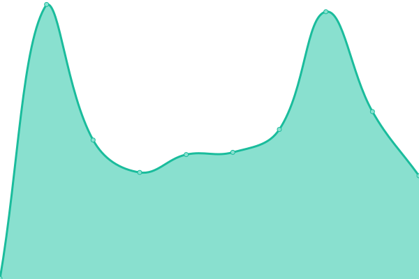
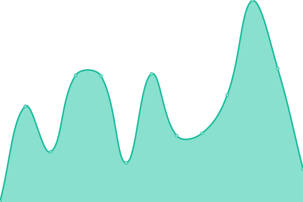
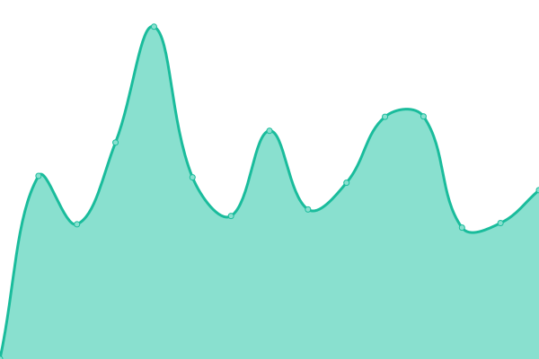

# [📈 Live Status](https://status.gd1214b.tk): <!--live status--> **所有系统都可以运行**

This repository contains the open-source uptime monitor and status page for [gd1214b](https://blog.gd1214b.icu/), powered by [Upptime](https://github.com/upptime/upptime).

With [Upptime](https://upptime.js.org), you can get your own unlimited and free uptime monitor and status page, powered entirely by a GitHub repository. We use [Issues](https://github.com/gd1214b/gd1214b-uptime/issues) as incident reports, [Actions](https://github.com/gd1214b/gd1214b-uptime/actions) as uptime monitors, and [Pages](https://status.gd1214b.tk) for the status page.

<!--start: status pages-->
<!-- This summary is generated by Upptime (https://github.com/upptime/upptime) -->
<!-- Do not edit this manually, your changes will be overwritten -->
<!-- prettier-ignore -->
| 链接 | 状态 | 历史 | 响应时间 | 正常运行时间 |
| --- | ------ | ------- | ------------- | ------ |
|  [gd1214b's blog](https://blog.gd1214b.icu) | 🟩 正常运行 | [gd1214b-s-blog.yml](https://github.com/gd1214b/gd1214b-uptime/commits/HEAD/history/gd1214b-s-blog.yml) | 

 306毫秒
     
 | 

<a href="https://status.gd1214b.tk/history/gd1214b-s-blog">100.00%</a>
    

|  [gd1214b图床](https://figurebed.gd1214b.tk) | 🟩 正常运行 | [gd1214b.yml](https://github.com/gd1214b/gd1214b-uptime/commits/HEAD/history/gd1214b.yml) | 

 273毫秒
     
 | 

<a href="https://status.gd1214b.tk/history/gd1214b">100.00%</a>
    

|  [gd1214b随机密码生成器](https://password.gd1214b.tk) | 🟩 正常运行 | [gd1214b.yml](https://github.com/gd1214b/gd1214b-uptime/commits/HEAD/history/gd1214b.yml) | 

 273毫秒
     
 | 

<a href="https://status.gd1214b.tk/history/gd1214b">100.00%</a>
    

|  [gd1214b-2048-game](http://2048.gd1214b.tk) | 🟩 正常运行 | [gd1214b-2048-game.yml](https://github.com/gd1214b/gd1214b-uptime/commits/HEAD/history/gd1214b-2048-game.yml) | 

 326毫秒
     
 | 

<a href="https://status.gd1214b.tk/history/gd1214b-2048-game">100.00%</a>
    

|  [Apibug](https://apibug.cn) | 🟩 正常运行 | [apibug.yml](https://github.com/gd1214b/gd1214b-uptime/commits/HEAD/history/apibug.yml) | 

 1487毫秒
     
 | 

<a href="https://status.gd1214b.tk/history/apibug">98.48%</a>
    

<!--end: status pages-->

[**Visit our status website →**](https://status.gd1214b.tk)

## 📄 License

- Powered by: [Upptime](https://github.com/upptime/upptime)
- Code: [MIT](./LICENSE) © [gd1214b](https://blog.gd1214b.icu/)
- Data in the `./history` directory: [Open Database License](https://opendatacommons.org/licenses/odbl/1-0/)
