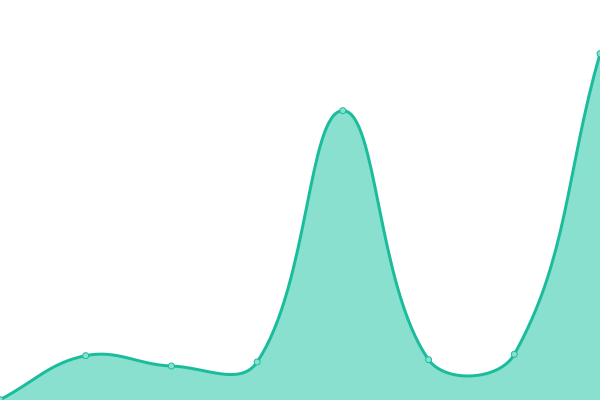
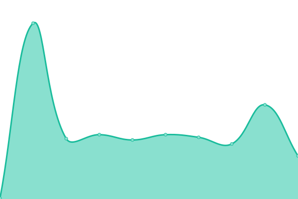

# [📈 Live Status](https://status.gd1214b.tk): <!--live status--> **所有系统都可以正常运行**

This repository contains the open-source uptime monitor and status page for [gd1214b](https://blog.gd1214b.icu/), powered by [Upptime](https://github.com/upptime/upptime).

With [Upptime](https://upptime.js.org), you can get your own unlimited and free uptime monitor and status page, powered entirely by a GitHub repository. We use [Issues](https://github.com/gd1214b/gd1214b-uptime/issues) as incident reports, [Actions](https://github.com/gd1214b/gd1214b-uptime/actions) as uptime monitors, and [Pages](https://status.gd1214b.tk) for the status page.

<!--start: status pages-->
<!-- This summary is generated by Upptime (https://github.com/upptime/upptime) -->
<!-- Do not edit this manually, your changes will be overwritten -->
<!-- prettier-ignore -->
| 链接 | 状态 | 历史 | 响应时间 | 正常运行时间 |
| --- | ------ | ------- | ------------- | ------ |
|  [blog](https://blog.gd1214b.icu) | 🟩 正常运行 | [blog.yml](https://github.com/gd1214b/uptime/commits/HEAD/history/blog.yml) | 

 171毫秒
     
 | 

<a href="https://status.gd1214b.tk/history/blog">100.00%</a>
    

|  [figurebed](https://figurebed.gd1214b.tk) | 🟩 正常运行 | [figurebed.yml](https://github.com/gd1214b/uptime/commits/HEAD/history/figurebed.yml) | 

 303毫秒
     
 | 

<a href="https://status.gd1214b.tk/history/figurebed">99.81%</a>
    

|  [password](https://password.gd1214b.tk) | 🟩 正常运行 | [password.yml](https://github.com/gd1214b/uptime/commits/HEAD/history/password.yml) | 

 896毫秒
     
 | 

<a href="https://status.gd1214b.tk/history/password">99.82%</a>
    

|  [2048-game](http://2048.gd1214b.tk) | 🟩 正常运行 | [2048-game.yml](https://github.com/gd1214b/uptime/commits/HEAD/history/2048-game.yml) | 

 277毫秒
     
 | 

<a href="https://status.gd1214b.tk/history/2048-game">100.00%</a>
    

|  [uptime](https://status.gd1214b.tk) | 🟩 正常运行 | [uptime.yml](https://github.com/gd1214b/uptime/commits/HEAD/history/uptime.yml) | 

 720毫秒
     
 | 

<a href="https://status.gd1214b.tk/history/uptime">100.00%</a>
    

|  [Betteruptime](https://betteruptime.com/api/v1/heartbeat/eMQG26cDhNk4YdJN6tQDXiBx) | 🟩 正常运行 | [betteruptime.yml](https://github.com/gd1214b/uptime/commits/HEAD/history/betteruptime.yml) | 

 322毫秒
     
 | 

<a href="https://status.gd1214b.tk/history/betteruptime">100.00%</a>
    

|  [Clash订阅链接转换](https://subweb.gd1214b.tk/) | 🟩 正常运行 | [clash.yml](https://github.com/gd1214b/uptime/commits/HEAD/history/clash.yml) | 

 308毫秒
     
 | 

<a href="https://status.gd1214b.tk/history/clash">100.00%</a>
    

|  [Apibug-IP](https://apibug.cn/api/ipqm/&apiKey=60829979f01d212c351a634101d764d8) | 🟩 正常运行 | [apibug-ip.yml](https://github.com/gd1214b/uptime/commits/HEAD/history/apibug-ip.yml) | 

 3997毫秒
     
 | 

<a href="https://status.gd1214b.tk/history/apibug-ip">96.11%</a>
    

|  [Apibug-Background](https://apibug.cn/api/ecy/&apiKey=72c1f1258741e617b805dd938a387639) | 🟩 正常运行 | [apibug-background.yml](https://github.com/gd1214b/uptime/commits/HEAD/history/apibug-background.yml) | 

 3120毫秒
     
 | 

<a href="https://status.gd1214b.tk/history/apibug-background">96.38%</a>
    

|  [drive](https://drive.gd1214b.tk/) | 🟩 正常运行 | [drive.yml](https://github.com/gd1214b/uptime/commits/HEAD/history/drive.yml) | 

 211毫秒
     
 | 

<a href="https://status.gd1214b.tk/history/drive">100.00%</a>
    

<!--end: status pages-->

[**Visit our status website →**](https://status.gd1214b.tk)

## 📄 License

- Powered by: [Upptime](https://github.com/upptime/upptime)
- Code: [MIT](./LICENSE) © [gd1214b](https://blog.gd1214b.icu/)
- Data in the `./history` directory: [Open Database License](https://opendatacommons.org/licenses/odbl/1-0/)
