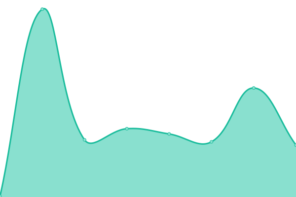
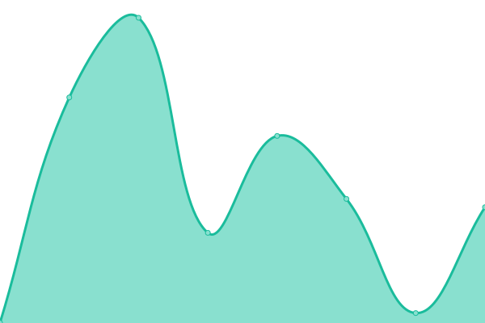
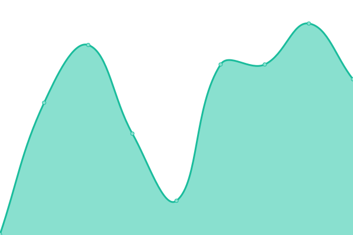

# [📈 Live Status](https://status.gd1214b.tk): <!--live status--> **所有系统都可以正常运行**

This repository contains the open-source uptime monitor and status page for [gd1214b](https://blog.gd1214b.icu/), powered by [Upptime](https://github.com/upptime/upptime).

With [Upptime](https://upptime.js.org), you can get your own unlimited and free uptime monitor and status page, powered entirely by a GitHub repository. We use [Issues](https://github.com/gd1214b/gd1214b-uptime/issues) as incident reports, [Actions](https://github.com/gd1214b/gd1214b-uptime/actions) as uptime monitors, and [Pages](https://status.gd1214b.tk) for the status page.

<!--start: status pages-->
<!-- This summary is generated by Upptime (https://github.com/upptime/upptime) -->
<!-- Do not edit this manually, your changes will be overwritten -->
<!-- prettier-ignore -->
| 链接 | 状态 | 历史 | 响应时间 | 正常运行时间 |
| --- | ------ | ------- | ------------- | ------ |
|  [blog](https://blog.gd1214b.icu) | 🟩 正常运行 | [blog.yml](https://github.com/gd1214b/uptime/commits/HEAD/history/blog.yml) | 

 251毫秒
     
 | 

<a href="https://status.gd1214b.tk/history/blog">100.00%</a>
    

|  [figurebed](https://figurebed.gd1214b.tk) | 🟩 正常运行 | [figurebed.yml](https://github.com/gd1214b/uptime/commits/HEAD/history/figurebed.yml) | 

 345毫秒
     
 | 

<a href="https://status.gd1214b.tk/history/figurebed">100.00%</a>
    

|  [password](https://password.gd1214b.tk) | 🟩 正常运行 | [password.yml](https://github.com/gd1214b/uptime/commits/HEAD/history/password.yml) | 

 292毫秒
     
 | 

<a href="https://status.gd1214b.tk/history/password">100.00%</a>
    

|  [2048-game](http://2048.gd1214b.tk) | 🟩 正常运行 | [2048-game.yml](https://github.com/gd1214b/uptime/commits/HEAD/history/2048-game.yml) | 

 330毫秒
     
 | 

<a href="https://status.gd1214b.tk/history/2048-game">100.00%</a>
    

|  [Clash订阅链接转换](https://www.clash-subweb.cf/) | 🟩 正常运行 | [clash.yml](https://github.com/gd1214b/uptime/commits/HEAD/history/clash.yml) | 

 494毫秒
     
 | 

<a href="https://status.gd1214b.tk/history/clash">100.00%</a>
    

|  [drive](https://drive.gd1214b.tk/) | 🟩 正常运行 | [drive.yml](https://github.com/gd1214b/uptime/commits/HEAD/history/drive.yml) | 

 2955毫秒
     
 | 

<a href="https://status.gd1214b.tk/history/drive">100.00%</a>
    

|  [netease-music](https://music.gd1214b.tk/) | 🟩 正常运行 | [netease-music.yml](https://github.com/gd1214b/uptime/commits/HEAD/history/netease-music.yml) | 

 235毫秒
     
 | 

<a href="https://status.gd1214b.tk/history/netease-music">100.00%</a>
    

|  [win11-react](https://win11-react.cf/) | 🟩 正常运行 | [win11-react.yml](https://github.com/gd1214b/uptime/commits/HEAD/history/win11-react.yml) | 

 891毫秒
     
 | 

<a href="https://status.gd1214b.tk/history/win11-react">100.00%</a>
    

|  [life-restart](https://liferestart.cf/public/index.html) | 🟩 正常运行 | [life-restart.yml](https://github.com/gd1214b/uptime/commits/HEAD/history/life-restart.yml) | 

 675毫秒
     
 | 

<a href="https://status.gd1214b.tk/history/life-restart">100.00%</a>
    

<!--end: status pages-->

[**Visit our status website →**](https://status.gd1214b.tk)

## 📄 License

- Powered by: [Upptime](https://github.com/upptime/upptime)
- Code: [MIT](./LICENSE) © [gd1214b](https://blog.gd1214b.icu/)
- Data in the `./history` directory: [Open Database License](https://opendatacommons.org/licenses/odbl/1-0/)
