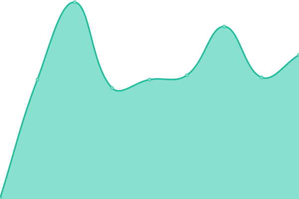

# [📈 Live Status](https://status.gd1214b.tk): <!--live status--> **所有系统都可以正常运行**

This repository contains the open-source uptime monitor and status page for [gd1214b](https://blog.gd1214b.icu/), powered by [Upptime](https://github.com/upptime/upptime).

With [Upptime](https://upptime.js.org), you can get your own unlimited and free uptime monitor and status page, powered entirely by a GitHub repository. We use [Issues](https://github.com/gd1214b/gd1214b-uptime/issues) as incident reports, [Actions](https://github.com/gd1214b/gd1214b-uptime/actions) as uptime monitors, and [Pages](https://status.gd1214b.tk) for the status page.

<!--start: status pages-->
<!-- This summary is generated by Upptime (https://github.com/upptime/upptime) -->
<!-- Do not edit this manually, your changes will be overwritten -->
<!-- prettier-ignore -->
| 链接 | 状态 | 历史 | 响应时间 | 正常运行时间 |
| --- | ------ | ------- | ------------- | ------ |
|  [gd1214b-blog](https://blog.gd1214b.icu) | 🟩 正常运行 | [gd1214b-blog.yml](https://github.com/gd1214b/gd1214b-uptime/commits/HEAD/history/gd1214b-blog.yml) | 

 288毫秒
     
 | 

<a href="https://status.gd1214b.tk/history/gd1214b-blog">99.73%</a>
    

|  [gd1214b-figurebed](https://figurebed.gd1214b.tk) | 🟩 正常运行 | [gd1214b-figurebed.yml](https://github.com/gd1214b/gd1214b-uptime/commits/HEAD/history/gd1214b-figurebed.yml) | 

 334毫秒
     
 | 

<a href="https://status.gd1214b.tk/history/gd1214b-figurebed">100.00%</a>
    

|  [gd1214b-password](https://password.gd1214b.tk) | 🟩 正常运行 | [gd1214b-password.yml](https://github.com/gd1214b/gd1214b-uptime/commits/HEAD/history/gd1214b-password.yml) | 

 399毫秒
     
 | 

<a href="https://status.gd1214b.tk/history/gd1214b-password">100.00%</a>
    

|  [gd1214b-2048](http://2048.gd1214b.tk) | 🟩 正常运行 | [gd1214b-2048.yml](https://github.com/gd1214b/gd1214b-uptime/commits/HEAD/history/gd1214b-2048.yml) | 

 204毫秒
     
 | 

<a href="https://status.gd1214b.tk/history/gd1214b-2048">100.00%</a>
    

|  [gd1214b-uptime](https://status.gd1214b.tk) | 🟩 正常运行 | [gd1214b-uptime.yml](https://github.com/gd1214b/gd1214b-uptime/commits/HEAD/history/gd1214b-uptime.yml) | 

 233毫秒
     
 | 

<a href="https://status.gd1214b.tk/history/gd1214b-uptime">100.00%</a>
    

|  [Apibug](https://apibug.cn) | 🟩 正常运行 | [apibug.yml](https://github.com/gd1214b/gd1214b-uptime/commits/HEAD/history/apibug.yml) | 

 1649毫秒
     
 | 

<a href="https://status.gd1214b.tk/history/apibug">88.80%</a>
    

|  [Betteruptime](https://betteruptime.com/api/v1/heartbeat/eMQG26cDhNk4YdJN6tQDXiBx) | 🟩 正常运行 | [betteruptime.yml](https://github.com/gd1214b/gd1214b-uptime/commits/HEAD/history/betteruptime.yml) | 

 467毫秒
     
 | 

<a href="https://status.gd1214b.tk/history/betteruptime">100.00%</a>
    

|  [Clash订阅链接转换](https://subweb.gd1214b.tk/) | 🟩 正常运行 | [clash.yml](https://github.com/gd1214b/gd1214b-uptime/commits/HEAD/history/clash.yml) | 

 142毫秒
     
 | 

<a href="https://status.gd1214b.tk/history/clash">100.00%</a>
    

<!--end: status pages-->

[**Visit our status website →**](https://status.gd1214b.tk)

## 📄 License

- Powered by: [Upptime](https://github.com/upptime/upptime)
- Code: [MIT](./LICENSE) © [gd1214b](https://blog.gd1214b.icu/)
- Data in the `./history` directory: [Open Database License](https://opendatacommons.org/licenses/odbl/1-0/)
